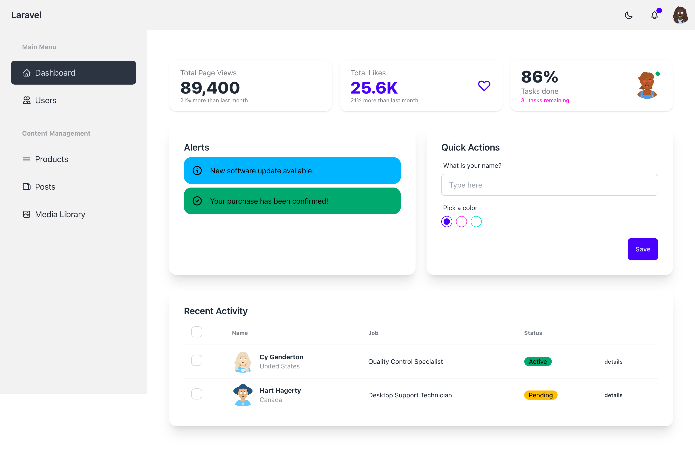

# Laravel DaisyUI Starter Kit

A beautiful Laravel starter kit with DaisyUI integration, providing a modern and responsive UI framework for your Laravel applications. Built with Tailwind CSS v4 and the latest DaisyUI.

## Features

- 🎨 DaisyUI components integration
- 🌓 Dark mode support with theme persistence
- 📱 Responsive design
- 🎯 CSS-first theme configuration
- 🚀 Easy to customize
- 📦 Simple installation
- 🔐 Authentication with Laravel Breeze
- ⚡ Tailwind CSS v4 integration
- 📱 Ready-to-use example pages and components

## Requirements

- PHP ^8.2
- Laravel ^12.0
- Node.js & NPM

## Installation

1. Create a new Laravel project:
```bash
laravel new my-project
cd my-project
```

2. Install Laravel Breeze:
```bash
composer require laravel/breeze --dev
php artisan breeze:install
```
When prompted, select the "Blade with Alpine" option.

3. Install the package via composer:
```bash
composer require sanjaya/laravel-daisyui-starter:v1.0
```

4. Run the installation command:
```bash
php artisan daisyui-starter:install
```

This will:
- Publish the package assets and example pages
- Install required NPM packages
- Configure Vite with Tailwind CSS
- Set up the theme configuration
- Build the assets

5. Start your development server:
```bash
php artisan serve
```

6. In a separate terminal, start the Vite development server:
```bash
npm run dev
```

## Example Pages and Components

The package comes with pre-built example pages showcasing various DaisyUI components:

### Layout Structure

The base layout (`resources/views/vendor/layouts/app.blade.php`) includes:
- Responsive navigation bar
- Theme switcher (light/dark mode)
- User dropdown menu
- Automatic theme persistence using localStorage

To use the layout in your views:
```php
<x-app-layout>
    <!-- Your content here -->
</x-app-layout>
```

### Dashboard Example

The dashboard example (`resources/views/vendor/dashboard.blade.php`) demonstrates:

1. **Stats Cards**:
```html
<div class="stats shadow">
    <div class="stat">
        <div class="stat-title">Total Page Views</div>
        <div class="stat-value">89,400</div>
        <div class="stat-desc">21% more than last month</div>
    </div>
</div>
```

2. **Alert Components**:
```html
<div class="alert alert-info">
    <svg xmlns="http://www.w3.org/2000/svg" fill="none" viewBox="0 0 24 24" class="stroke-current shrink-0 w-6 h-6">
        <path stroke-linecap="round" stroke-linejoin="round" stroke-width="2" d="M13 16h-1v-4h-1m1-4h.01M21 12a9 9 0 11-18 0 9 9 0 0118 0z"></path>
    </svg>
    <span>New software update available.</span>
</div>
```

3. **Form Elements**:
```html
<div class="form-control w-full">
    <label class="label">
        <span class="label-text">What is your name?</span>
    </label>
    <input type="text" placeholder="Type here" class="input input-bordered w-full" />
</div>
```

4. **Data Tables**:
```html
<div class="overflow-x-auto">
    <table class="table">
        <thead>
            <tr>
                <th>Name</th>
                <th>Job</th>
                <th>Status</th>
            </tr>
        </thead>
        <tbody>
            <tr>
                <td>John Doe</td>
                <td>Developer</td>
                <td><div class="badge badge-success">Active</div></td>
            </tr>
        </tbody>
    </table>
</div>
```

### Common Components

1. **Buttons**:
```html
<button class="btn">Button</button>
<button class="btn btn-primary">Primary</button>
<button class="btn btn-secondary">Secondary</button>
<button class="btn btn-accent">Accent</button>
<button class="btn btn-ghost">Ghost</button>
```

2. **Cards**:
```html
<div class="card bg-base-100 shadow-xl">
    <div class="card-body">
        <h2 class="card-title">Card Title</h2>
        <p>Content</p>
        <div class="card-actions justify-end">
            <button class="btn btn-primary">Action</button>
        </div>
    </div>
</div>
```

3. **Badges**:
```html
<div class="badge">Default</div>
<div class="badge badge-primary">Primary</div>
<div class="badge badge-secondary">Secondary</div>
<div class="badge badge-accent">Accent</div>
```

4. **Avatars**:
```html
<div class="avatar">
    <div class="w-24 rounded-full">
        
    </div>
</div>
```

5. **Dropdowns**:
```html
<div class="dropdown">
    <label tabindex="0" class="btn m-1">Click</label>
    <ul tabindex="0" class="dropdown-content menu p-2 shadow bg-base-100 rounded-box w-52">
        <li><a>Item 1</a></li>
        <li><a>Item 2</a></li>
    </ul>
</div>
```

## Screenshots

### Dashboard


### Login Page


## Theme Configuration

Themes are now configured directly in your CSS using CSS variables, following Tailwind CSS v4's CSS-first approach. The configuration is located in `resources/css/app.css`:

```css
@layer theme {
    :root {
        --theme: "light";
        --color-primary: oklch(0.6569 0.196 275.75);
        --color-secondary: oklch(0.7176 0.158 342.55);
        --color-accent: oklch(0.7059 0.169 183.61);
        /* ... other color variables ... */
    }

    [data-theme="dark"] {
        --theme: "dark";
        --color-base-100: oklch(0.2 0 0);
    }
}
```

### Customizing Colors

To customize your theme colors, modify the CSS variables in `resources/css/app.css`. Available color variables:

- `--color-primary`: Main brand color
- `--color-secondary`: Secondary brand color
- `--color-accent`: Accent color
- `--color-neutral`: Neutral color
- `--color-base-100`: Background color
- `--color-info`: Information color
- `--color-success`: Success color
- `--color-warning`: Warning color
- `--color-error`: Error color

### Switching Themes

To switch themes in your Blade templates:

```html
<html data-theme="light">
    <!-- For light theme -->
</html>

<!-- OR -->

<html data-theme="dark">
    <!-- For dark theme -->
</html>
```

For dynamic theme switching:

```php
<html data-theme="{{ $theme }}">
    <!-- Your content -->
</html>
```

## Usage

After installation, you can use DaisyUI components in your views:

```html
<button class="btn btn-primary">Primary Button</button>
<div class="card">
    <div class="card-body">
        <h2 class="card-title">Card Title</h2>
        <p>Card content</p>
    </div>
</div>
```

### Authentication

The package integrates with Laravel Breeze for authentication. All auth views are styled with DaisyUI components. Available routes:

- Login: `/login`
- Register: `/register`
- Password Reset: `/forgot-password`
- Profile: `/profile`

## Troubleshooting

### Common Issues

1. If you get a stability error when installing, use:
```bash
composer require sanjaya/laravel-daisyui-starter:dev-main
```

2. If assets are not showing up correctly:
- Make sure you've published all assets
- Clear your Laravel cache: `php artisan cache:clear`
- Rebuild your npm assets: `npm run build`

3. If themes are not applying:
- Ensure the `data-theme` attribute is properly set on your HTML elements
- Check that your CSS variables are correctly defined in `resources/css/app.css`
- Make sure Vite is properly building your assets

## Security

If you discover any security related issues, please create a issue using the issue tracker.

## License

The MIT License (MIT). Please see [License File](LICENSE.md) for more information.